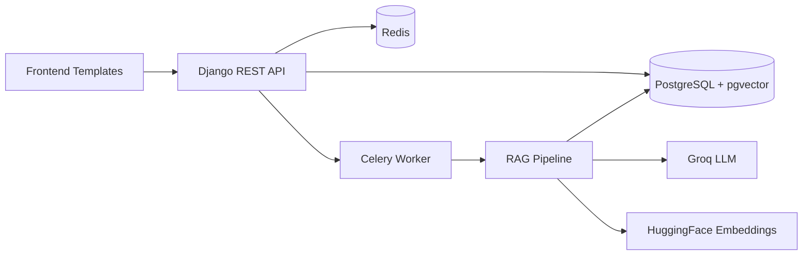

# PDF Chatbot

AI-powered resume screening app built with Django + DRF + Celery + PostgreSQL/pgvector.

Upload resume PDFs, process them into vector chunks, chat with a single candidate profile, generate candidate analysis, and rank candidates against a job description.

## Features

- Batch PDF upload with per-file outcomes (`accepted`, `rejected`, `skipped`)
- Duplicate detection using SHA-256 file hash
- Resume metadata extraction (name/email/date) and validation
- Async PDF processing with Celery + Redis
- Vector embeddings stored in PostgreSQL via pgvector
- RAG-based candidate chat and analysis
- Candidate ranking against a job description with JSON scoring
- LLM response caching for analysis and ranking
- Frontend pages for upload, chat, analysis, and ranking

## Tech Stack

- Backend: Django 6, Django REST Framework
- Async jobs: Celery
- Broker/Result backend: Redis
- Database: PostgreSQL + pgvector
- Embeddings: `sentence-transformers/all-MiniLM-L6-v2`
- LLM: Groq (`llama-3.3-70b-versatile`)
- PDF parsing: `pdfplumber`, `pypdf`

## Project Structure

```text
.
├─ config/               # Django config + Celery setup
├─ core/                 # Models, serializers, API views, URL routes
├─ rag/                  # RAG pipeline (loader/splitter/retrieval/engine)
├─ prompts/              # Prompt templates
├─ frontend/             # Django templates (UI pages)
├─ media/documents/      # Uploaded files
├─ manage.py
└─ requirements.txt
```

## Architecture

High-level architecture:



Architecture diagram placeholder:


## System Design

### End-to-End Flow

1. User uploads one or more PDFs from the Upload UI.
2. API computes file hash and validates metadata (email required).
3. API marks each file as accepted, rejected, or skipped with reason.
4. Accepted files are queued to Celery for async processing.
5. Worker loads PDF pages, splits text, creates embeddings, and stores chunks in pgvector.
6. Chat and analysis endpoints retrieve relevant chunks and call the LLM.
7. Ranking endpoint evaluates candidates against job description and returns sorted results.
8. LLM outputs are cached to reduce repeated cost and latency.

System flow diagram placeholder:


### Core Components

- API Layer: DRF endpoints for upload, chat, analysis, ranking, and listing batches/documents.
- Processing Layer: Celery worker for non-blocking PDF processing.
- Retrieval Layer: Chunking + embedding + similarity retrieval from pgvector-backed store.
- Intelligence Layer: LLM prompt orchestration for analysis, chat, and ranking.
- Caching Layer: LLM cache table keyed by document hash and request context.

## Engineering Decisions

### 1) Asynchronous PDF Processing with Celery

- Decision: Process accepted resumes in background tasks.
- Why: Upload API stays responsive for large batches.
- Trade-off: Requires Redis + worker operations and monitoring.

### 2) pgvector in PostgreSQL

- Decision: Store embeddings in the same primary relational database.
- Why: Simpler deployment and transactional consistency with document metadata.
- Trade-off: Dedicated vector databases can offer better horizontal scaling.

### 3) Hash-Based Duplicate Detection

- Decision: Use SHA-256 hash per uploaded file.
- Why: Fast, deterministic duplicate prevention.
- Trade-off: Content-level near-duplicates are not detected if binary differs.

### 4) Metadata-Based Rejection Rules

- Decision: Reject resumes without a valid candidate email.
- Why: Keeps downstream ranking and communication workflows usable.
- Trade-off: Some potentially strong candidates are filtered early.

### 5) Cache LLM Outputs

- Decision: Cache analysis and ranking outputs by document hash and request context.
- Why: Reduces latency and API cost for repeated queries.
- Trade-off: Cache invalidation logic is required when document content changes.

### 6) Single-Service Django + Template UI

- Decision: Keep frontend templates and backend in one Django app.
- Why: Fast iteration, simple hosting, lower operational complexity.
- Trade-off: Less separation than SPA + dedicated API service architecture.

## Production Readiness Checklist

- Set DEBUG to False and configure ALLOWED_HOSTS.
- Move secrets to environment/secret manager.
- Use TLS and secure reverse proxy (Nginx/Caddy).
- Configure persistent Celery worker process manager.
- Enable structured logging and centralized log sink.
- Add health checks for web, worker, Redis, and database.
- Add request throttling and upload size limits.
- Add CI for tests and linting.
- Add backup and restore plan for PostgreSQL.
- Add monitoring dashboards and alerting.

## Prerequisites

- Python 3.12+
- PostgreSQL 14+ with pgvector extension
- Redis running locally on port `6379`
- Groq API key

## Environment Variables

Create a `.env` file in the project root:

```env
DB_NAME=your_db_name
DB_USER=your_db_user
DB_PASSWORD=your_db_password
DB_HOST=127.0.0.1
DB_PORT=5432
GROQ_API_KEY=your_groq_api_key
```

## Database Setup (PostgreSQL + pgvector)

1. Create your database.
2. Enable the vector extension:

```sql
CREATE EXTENSION IF NOT EXISTS vector;
```

## Installation

```bash
# 1) Clone
git clone <your-repo-url>
cd PDF-Chatbot

# 2) Create and activate virtual environment
python -m venv chatbot_env
# Windows (PowerShell)
.\chatbot_env\Scripts\Activate.ps1
# macOS/Linux
source chatbot_env/bin/activate

# 3) Install dependencies
pip install -r requirements.txt

# 4) Run migrations
python manage.py migrate
```

## Run the App

Start each service in a separate terminal.

### 1) Django server

```bash
python manage.py runserver
```

### 2) Celery worker

```bash
python -m celery -A config worker -l info -P solo --concurrency=1
```

### 3) Redis

Run Redis locally (example):

```bash
redis-server
```

## Web UI Routes

- `/` - Home
- `/upload/` - Upload resumes
- `/chat/` - Chat with a selected resume
- `/analysis/` - Generate candidate analysis
- `/ranking/` - Rank candidates against a job description

## UI Screenshots (Placeholders)

Replace these image paths with your real screenshots.

### Home Page (`/`)

```md

```


### Upload Page (`/upload/`)

```md

```


### Chat Page (`/chat/`)

```md

```


### Analysis Page (`/analysis/`)

```md

```


### Ranking Page (`/ranking/`)

```md

```


## API Endpoints

Base path: `/api/`

- `GET /api/batches/`
  - List all batches
  - Screenshot placeholder:
    ```md
    
    ```

- `GET /api/documents/?batch_id=<id>`
  - List candidate documents (optionally filtered by batch)
  - Screenshot placeholder:
    ```md
    
    ```

- `POST /api/upload/`
  - Multipart upload with one or more `pdf` files and optional `batch`
  - Returns totals + per-file details
  - Screenshot placeholder:
    ```md
    
    ```

- `POST /api/chat/`
  - Body:
    ```json
    {
      "document_id": 1,
      "question": "What are this candidate's strengths?"
    }
    ```
  - Screenshot placeholder:
    ```md
    
    ```

- `POST /api/resume/analyze/`
  - Body:
    ```json
    {
      "document_id": 1
    }
    ```
  - Screenshot placeholder:
    ```md
    
    ```

- `POST /api/resume/rank/`
  - Body:
    ```json
    {
      "job_description": "Python backend engineer with NLP and Django",
      "batch": "Q4-hiring"
    }
    ```
  - Screenshot placeholder:
    ```md
    
    ```

## Upload Response Format

`POST /api/upload/` returns:

```json
{
  "totals": {
    "accepted": 2,
    "rejected": 1,
    "skipped": 1
  },
  "details": [
    {
      "filename": "resume_a.pdf",
      "status": "accepted",
      "document_id": 12,
      "task_id": "..."
    },
    {
      "filename": "resume_b.pdf",
      "status": "rejected",
      "reason": "Rejected: Missing required email contact info."
    },
    {
      "filename": "resume_c.pdf",
      "status": "skipped",
      "reason": "Duplicate resume skipped."
    }
  ]
}
```

## Common Rejection/Skip Reasons

- `Rejected: Missing required email contact info.`
- `Duplicate resume skipped.`
- `Skipped: A newer version of this resume already exists.`

## Running Tests

```bash
python manage.py test
```

## Notes

- The current Django settings use `DEBUG=True` for development.
- Do not commit real secrets in `.env`.
- Ensure pgvector is enabled before running vector-related features.

## Troubleshooting

- Celery command not found:
  - Use the virtual environment and run `python -m celery ...` instead of `celery ...`.

- Upload works but processing never finishes:
  - Confirm Redis is running.
  - Confirm Celery worker is running.

- Database connection errors:
  - Verify `.env` values for `DB_*`.
  - Ensure PostgreSQL is reachable on the configured host/port.

- LLM requests failing:
  - Verify `GROQ_API_KEY` is present and valid.

## License

Add your preferred license (MIT, Apache-2.0, etc.).
